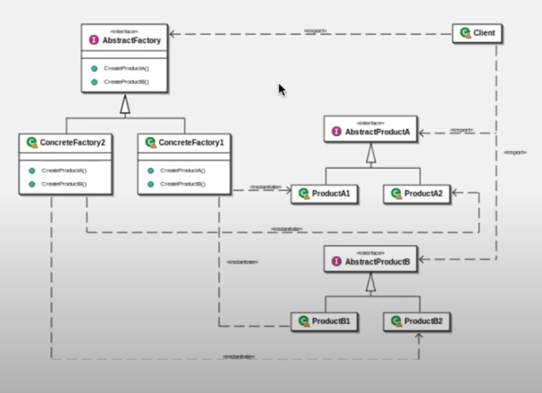

디자인패턴 Ref: Youtube 이야기's G 자바 디자인 패턴

## 추상팩토리 패턴
---
### 목표1
- 관련있는 객체의 생성을 가상화 할 수 있다.

### 키워드
- 생성 부분의 가상화
- 관련 있는 객체
---

### 구초


### 첫번째 예제코드
```
public interface Wheel{
    
}

public interface Body{

}

public interface BikeFactory{
    public Body createBody();
    public Wheel createWheel();
}
//----여기까지 abst 패키지

public class SamFactory implements BikeFactory{
    @Override
    public Body createBody(){

        return new SamBody();
    }
    @Override
    public Wheel createWheel(){

        return new SamWheel();
    }
}

public class SamBody implements Body{
   
}

public class SamWheel implements Wheel{
    
}
//------여기까지 Sam package
public class Main{
    public static void main(String[] args){
        BikeFactory factory = new SamFactory();
        BikeFactory Gtfactory = new GtFactory();

        Body body = factory.createBody();
        Wheel wheel = factory.createWheel();

        System.out.println(body.getClass());
        System.out.println(wheel.getClass());

    }
    // 이렇게 하는 이유
    // 일종의 클래스 공장을 만들어 내는행위
}

//------main

public class GtBody implements Body{

}

public class GtWheel implements Wheel{

}

public class GtBikeFactory implements BikeFactory{
    @Override
    public Body createBody(){

        return new GtBody();
    }
    @Override
    public Wheel createWheel(){

        return new GtWheel();
    }
}
```

