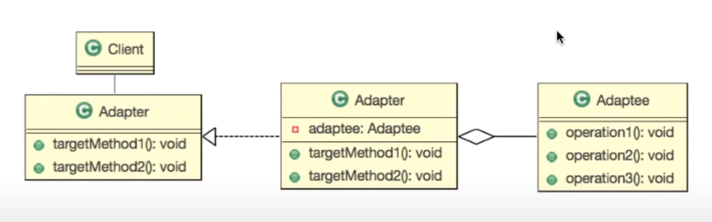

디자인패턴 Ref: Youtube 이야기's G 자바 디자인 패턴

## 어댑터 패턴
- 연관성 없는 두 객체를 사용
---
### 학습목표
- 알고리즘을 요구사항에 맞춰 사용할 수 있다.

### 사전적 의미의 Adapter란?
- 기계 기구 등을 다목적으로 사용하기 위한 부가 기구

### 어댑터 패턴의 기본 설계




주어진 어댑티 알고리즘을 어댑터라는 기능을 통해 원하는 기능으로 변경하는 것

---

## 예제 요구사항
- 두 수에 대한 다음 연산을 수행하는 객체를 만들어라
  - 수의 두 배의 수를 반환 : twiceOf(Float):Float
  - 수의 반의 수를 반환 : halfOf(Float):Float
- 구현 객체 이름은 Adapter으로 
- Math 클래스에서 두배와 절반을 구하는 함수는 이미 구현이 되어있다.

```
public class Main{
    Adapter adapter = new AdapterImpl();

    System.out.println(adapter.twiceOf(100f));
    System.out.println(adapter.halfOf(100));
}

public interface Adapter{
    //원하는 기능
    public Float twiceOf(Float f);

    //원하는 기능
    public Float halfOf(Float f);
}

public class AdapterImpl implements Adatper{
    Math math;

    @Override
    public Float twiceOf(Float f){
        return (float)Math.twoTime(f.doubleValue());
    }

    @Override
    public Float halfOf(Float f){
        return (float)Math.half(f.doubleValue()) ;
    }
}

```
---
## 더 공부해봅시다
- 알고리즘의 변경
  - Math클래스에서 새롭게 두배를 구할 수 있는 함수가 추가되었다. 새로 구현된 알고리즘을 이용하도록 프로그램을 수정해보자.
  - 절반을 구하는 기능에서 로그를 찍는 기능을 추가해라
  
```
public class Main{
    Adapter adapter = new AdapterImpl();

    System.out.println(adapter.twiceOf(100f));
    System.out.println(adapter.halfOf(100));
}

public interface Adapter{
    //원하는 기능
    public Float twiceOf(Float f);

    //원하는 기능
    public Float halfOf(Float f);
}

public class AdapterImpl implements Adatper{
    Math math;

    @Override
    public Float twiceOf(Float f)//강화된 알고리즘 추가
        return Math.doubled(f.doubleValue()).floatValue();
    }

    @Override
    public Float halfOf(Float f){//절반함수 내에 로그를 찍음
        System.out.println("절반함수 호출");
        return (float)Math.half(f.doubleValue()) ;
    }
}

```


