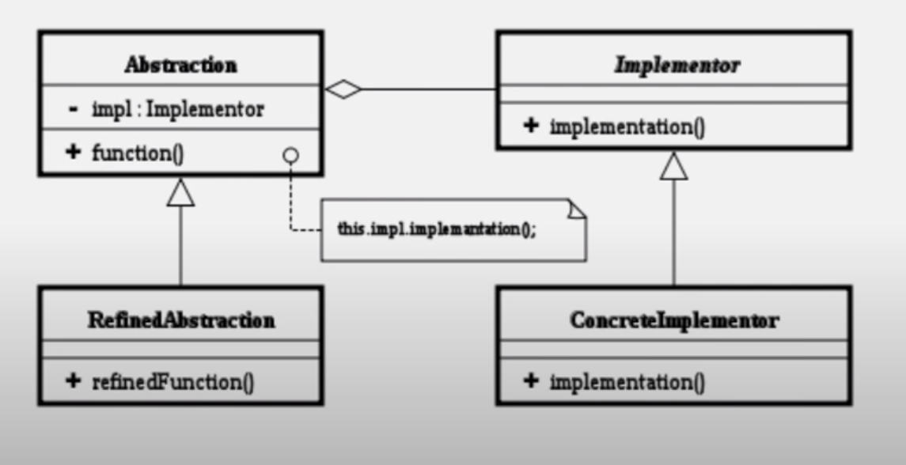

디자인패턴 Ref: Youtube 이야기's G 자바 디자인 패턴

## 브릿지 패턴
- 기능 계층과 구현 계층의 분리

### 학습목표
- 브릿지 패턴에 대해서 이해
- 어댑터 패턴과 브릿지 패턴을 연결하여 이해

### 키워드
- 기능부분과 구현부분을 분리

### 기본 설계


- 추상(기능)부분과 구현부분을 나눔
- 추상부분에 기능을 구현하여 재정의

### 실습 예제
```
public class DefaultMCF implements MorseCodeFunction{

	@Override
	public void dot() {
		// TODO Auto-generated method stub
		System.out.println(".");

	}

	@Override
	public void dash() {
		// TODO Auto-generated method stub
		System.out.println("-");

	}

	@Override
	public void space() {
		// TODO Auto-generated method stub
		System.out.println(" ");

	}
	
}

public class MorseCode {
	
	private MorseCodeFunction function;
	
	public MorseCode(MorseCodeFunction function) {
		this.function = function;
	}
	
	public void setFunction(MorseCodeFunction function) {
		this.function = function;
	}
	
	public void dot() {
		function.dot();
	}
	public void dash() {
		function.dash();
	}
	public void space() {
		function.space();
	}
}

public class MorseCode2 {
	public void dot() {
		System.out.println(".");
	}
	public void dash() {
		System.out.println("-");
	}
	public void space() {
		System.out.println(" ");
	}
}

public interface MorseCodeFunction {
	
	public void dot();
	public void dash();
	public void space();

}

public class PrintMorseCode extends MorseCode{
	public PrintMorseCode(MorseCodeFunction function) {
		super(function);
		// TODO Auto-generated constructor stub
	}
	//garam
	public PrintMorseCode g() {
		// - - .
		dash();
		dash();
		dot();
		space();

		return this;
	}
	public PrintMorseCode a() {
		dot();
		dash();
		space();

		return this;

	}
	public PrintMorseCode r() {
		dot();
		dash();
		dot();
		space();

		return this;

	}
	public PrintMorseCode m() {
		dash();
		dash();
		space();
		return this;

	}
}

public class PrintMorseCode2 extends MorseCode2{
	//garam
	public PrintMorseCode2 g() {
		// - - .
		dash();
		dash();
		dot();
		space();

		return this;
	}
	public PrintMorseCode2 a() {
		dot();
		dash();
		space();

		return this;

	}
	public PrintMorseCode2 r() {
		dot();
		dash();
		dot();
		space();

		return this;

	}
	public PrintMorseCode2 m() {
		dash();
		dash();
		space();
		return this;

	}
}

```