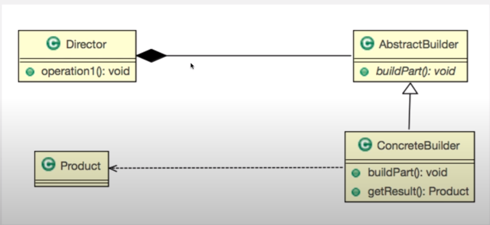

디자인패턴 Ref: Youtube 이야기's G 자바 디자인 패턴

## 빌더 패턴
---
### 학습목표
- 복잡한 단계가 필요한 인스턴스 생성을 빌더 패턴을 통해서 구현할 수 있다.

### 빌더란? 빌더의 사전적 의미
- 건축 업자, 시공자, 건조자
- 건설자

### 빌더패턴이란?
- 복잡한 단계를 거쳐야 생성되는 객체의 구현을 서브 클래스에게 넘겨주는 패턴


### 빌더패턴의 구조


- 모양 자체는 중요하지 않다
- 어떤 동작을 하는지 이해하면 어렵지 않다.


### 예제 코드(길다.)
```
public class Main{
    public static void main(String [] args){
        System.out.println("hello world");

        ComputerFactory factory = new ComputerFactory();
        factory.setBlueprint(new LgGramBlueprint());
        //factory.setBlueprint(new MacBlueprint());
        //factory.setBlueprint(new SonyBlueprint());
        //factory.setBlueprint(new LgGramBlueprint());

//        Computer computer = new factory.makeAndGet();


        Computer computer = new factory.make();
        
        Computer computer = new factory.getComputer();

        Computer computer = new Computer("I7", "16G", "256G")

        System.out.println(computer.toString());
    }
}

public class Computer{
    private String cpu;
    private String ram;
    private String strage;
    
	public Computer(String cpu, String ram, String strage) {
		super();
		this.cpu = cpu;
		this.ram = ram;
		this.strage = strage;
	}

	public String getCpu() {
		return cpu;
	}
	public void setCpu(String cpu) {
		this.cpu = cpu;
	}
	public String getRam() {
		return ram;
	}
	public void setRam(String ram) {
		this.ram = ram;
	}
	public String getStrage() {
		return strage;
	}
	public void setStrage(String strage) {
		this.strage = strage;
	}

    @Ovrride
    public String toString(){
        return cpu + "," + ram + "," + storage;
    }
}

public abstract class BluePrint {
	abstract public void setCpu();
	abstract public void setRam();
	abstract public void setStroage();
}

public class LgGramBlueprint extends BluePrint{

	Computer computer;
	
	
	public LgGramBlueprint() {
		computer = new Computer("default","default","default");
	}
	
	@Override
	public void setCpu() {
		computer.setCpu("i7");
	}

	@Override
	public void setRam() {
		// TODO Auto-generated method stub
		computer.setRam("8g");

	}

	@Override
	public void setStroage() {
		// TODO Auto-generated method stub
		computer.setStorage("256g");

	}

    @Override
	public Computer getComputer() {
		// TODO Auto-generated method stub
		return computer;
	}

}

public class ComputerFactory {
	private BluePrint print;
	
	public void setBlueprint(BluePrint print) {
		this.print = print;
	}
	
	public void make() {
		print.setRam();
		print.setCpu();
		print.setStroage();

	}

    public Computer getComputer(){
        new Computer(cpu, ram, storage);
        return computer;
    }
	
}


```


