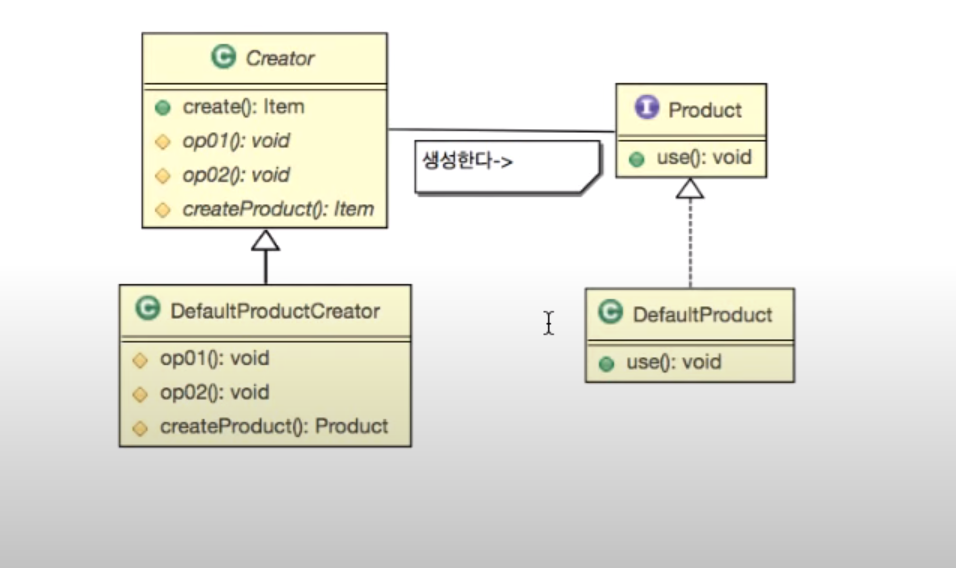

디자인패턴 Ref: Youtube 이야기's G 자바 디자인 패턴

# 팩토리 메서드 패턴

---
## 학습목표
- 팩토리 메소드 패턴에서 템플릿 메소드 패턴의 사용됨을 안다
- 팩토리 메소드 패턴에서 구조와 구현의 분리를 이해하고 구조와 구현의 분리의 장점을 안다.

### 팩토리 메소드 패턴의 기본 설계


---

### 요구사항
- 게임아이템과 아이템 생성을 구현
  - 아이템을 생성하기 전에 데이터 베이스에서 아이템 정보 요청
  - 아이템을 생성 후 아이템 복제 등의 불법을 방지하기 위해 데이터베이스에 아이템 생성 정보를 남김
- 아이템을 생성하는 주체를 ItemCreator로 이름 지음
- 아이템은 item이라는 interface로 다룰 수 있도록 한다.
  - item은 use 함수를 기본 함수로 갖고 있다
- 현재 아이템의 종류는 체력 회복 물약, 마력 회복 물약이 존재

---
## 예제코드
```
public abstract class ItemCreator{
    public Item create(){
        Item item;

        //step1
        requestItemsInfo();

        //step2
        item = createItem();

        //stem3
        createItemLog();

        return item;
    }//이런식으로 템플릿메소드의 형식으로 만든다.

    //아이템을 생성하기 전에 데이터 베이스에서 아이템 정보를 요청
    abstract protected void requestItemInfo();
    //아이템을 생성 후 아이템 복제 등의 불법을 방지하기 위해 데이터베이스에 아이템 생성
    abstract protected void createItemLog();
    //아이템을 생성하는 알고리즘
    abstract protected Item createItem();

}

public interface Item{
    public void use();
}

public class HpPotion implements Item{
    
    @Override
    public void use(){
        System.out.println("체력회복!");
    }
}

public class MpPotion implements Item{
    
    @Override
    public void use(){
        System.out.println("마나 회복!");
    }
}

public class HpCreator implements ItemCreator{
    
    @Override
    public void void requestItemInfo(){
        System.out.println("데이터베이스에서 회복 물약의 정보를 가져옵니다.");
    }

    @Override
    public void void createItemLog(){
        System.out.println("회복물약을 새로 생성했습니다." + new Date());       
    }

    @Override
    public void void createItem(){
        //작업
        return new HpPotion();
    }
}

public class MpCreator implements ItemCreator{
    
    @Override
    public void void requestItemInfo(){
        System.out.println("데이터베이스에서 마나 물약의 정보를 가져옵니다.");
    }

    @Override
    public void void createItemLog(){
        System.out.println("마나물약을 새로 생성했습니다." + new Date());       
    }

    @Override
    public void void createItem(){
        //작업
        return new MpPotion();
    }
}
public class Main{
    public static void main(String [] args){
        ItemCreator creator;
        Item item;

        creator = new HpCreator();
        item = creator.create();

        creator = new MpCreator();
        creator.create();
    }
}
```