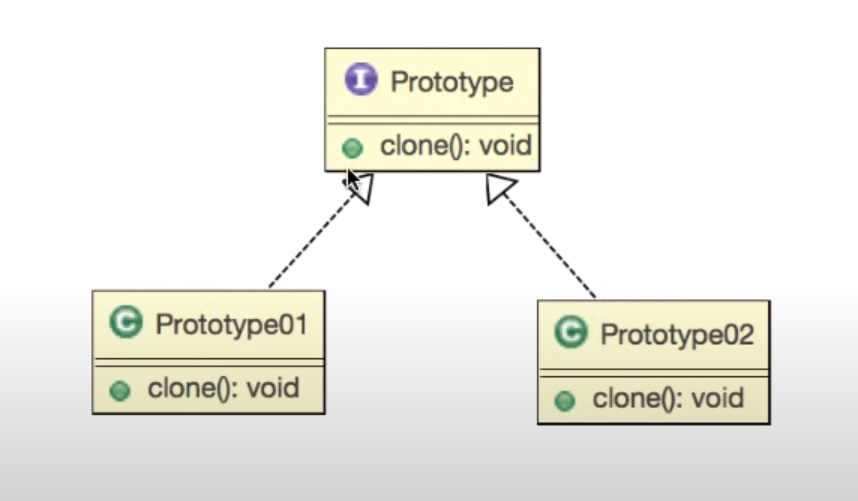

디자인패턴 Ref: Youtube 이야기's G 자바 디자인 패턴

## 프로토타입 패턴
---
### 사전적 의미의 프로토타입
1. 원형 : 본, 표준, 모범.
2. (어떤 것의)옛날의 유사물
3. 생 원형(archetype)

### 프로토타입 패턴
- 생산 비용이 높은 인스턴스를 복사를 통해서 쉽게 생성할 수 있도록 하는 패턴

### 인스턴스 생산 비용이 높은 경우
- 종류가 너무 많아서 클래스로 정리되지 않은 겨우
- 클래스로부터 인스턴스 생성이 어려운 경우

---

### 프로토타입의 기본 설계


<br/>
<br/>

### 요구사항
- 일러스트레이터와 같은 그림 그리기 툴을 개발중이다. 어떤 모양 그릴 수 있도록 하고 복사 붙여넣기 기능을 구현해라


### 예제 코드
```
Shape.java
public class Shape implements Cloneable{
    
    private String id;

    public void setId(String id){
        this.id = id;
    }

    public String getId(){
        return id;
    }
}
Circle.java
public class Circle extends Shape{
    private int x,y,r;

    public Circle(int x, int y, int r){
        super();
        this.x = x;
        this.y = y;
        this.r = r;
    }

    public void setX(String x){
        this.x = x;
    }

    public String getX(){
        return x;
    }
    public void setY(String y){
        this.y = y;
    }

    public String getY(){
        return y;
    }
    public void setR(String r){
        this.r = r;
    }

    public String getR(){
        return r;
    }

    public Circle copy() throws CloneNotSupportedException{
        Circle circle = (Circle)clone();
        return circle;
    }
}
public class Main{
        public static void main(String[] args){
            Circle circle1 = new Circle(1,1,3);
            Circle circle2 =  circle1.copy();
        
            System.out.println(
                circle1.getX() +","+ 
                circle1.getY() +"," + 
                circle1.getR());

             System.out.println(
                circle2.getX() +","+ 
                circle2.getY() +"," + 
                circle2.getR());

        }
    }
```
<br/>

### 더 공부해봅시다
- 복사 후 붙여넣기를 하면 두 도형이 겹치는데 안겹치도록 살짝 옆으로 이동하게 해라

```
//수정되는 소스만 변경
    public Circle copy() throws CloneNotSupportedException{
        Circle circle = (Circle)clone();
        circle.x += 1;
        circle.y += 1; //이 값으로 입력을 했겠지만 개인적으로 생성자에 선언된 길이를 참조하여 입력하는 편이 더 나은것 같다.
        return circle;
    }

```
- 프로토타입 구현시 Clonable이라는 인터페이스를 활용하여 copy함수를 재정의 함으로 프로토타입 패턴을 이용하여 복사를 가능하게끔 만들었다.


```
public class Main{
    public static void main(String [] args){
        //얉은 복사
        Cat navi = new Cat();
        navi.setName("navi");
        navi.setAge(new Age(2012,3));

        //Cat yo = navi;//복사라하기 그런 복사
       // yo.setName("yo");이때 나비의 이름과 yo의 이름둘다 yo가됨
        //이때 상황이 얉은 복사가됨

        
        //깊은 복사 : 선언한 값의 이름을 바꾸는 것이 깊은복사
        Cat yo = navi.copy();
        yo.setName("yo");//이때 yo라는 객체가 새로 복사가 되면서
        navi.setAge((new Age(2013,2));
        //이름 변경이 가능해진다.

    }
}

public class Cat implements Clonable{
    private String name;
    private Age age;

    public void setAge(String age){
       this.age = age;
    }

    public Age getAge(){
       return age;
    }

    public void setName(String name){
       this.name = name;
    }

    public String getName(){
       return name;
    }

    public Cat copy() throws CloneNotSupportedException{
        Cat ret = (Cat)this.clone();

        return ret;
    }
}

public class Age{
    int year;
    int value;

    public Age(int year, int value){
        super();
        this.year = year;
        this.value = value;
    }

    public void setYear(String year){
       this.year = year;
    }

    public String getYear(){
       return year;
    }

    public void setValue(String value){
       this.name = value;
    }

    public String getValue(){
       return value;
    }
}

```