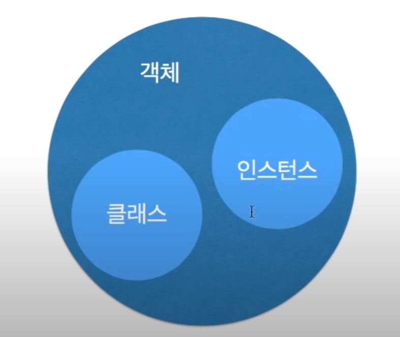
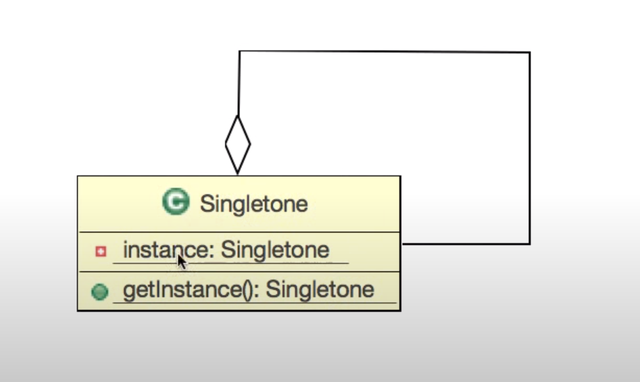

디자인패턴 Ref: Youtube 이야기's G 자바 디자인 패턴

# 싱글톤 패턴

## 객체란
- 객체 : 속성과 기능을 갖춘 것
- 클래스 : 속성과 기능을 정의한 것
- 인스턴스 : 속성과 기능을 가진 것 중 실제하는 것




## 학습목표
- 싱글톤 패턴을 통해서 하나의 인스턴스만 생성하도록 구현할 수 있다.

## 사전적 의미의 Singleton이란?
- 하나만 생성해야 할 객체를 위한 패턴

## 기본 설계

---
## 요구사항
- 개발 중인 시스템에서 스피커에 접근 할 수 있는 클래스를 만들어 달라.


### 예제 코드
```
public class SystemSpeaker{
    static private SystemSpeaker instance;
    private int volume;

    private SystemSpeaker(){
        volume = 5;
    }

    public static SystemSpeaker getInstance(){
        if(instance == null){
            //시스템 스피커
            instance = new SystemSpeaker();
            System.out.println("새로 생성")
        }else{
            System.out.println("이미 생성")
        }
        return instance;
    }

    public int getVolume(){
        return volume;
    }
    public void setVolume(int volume){
        this.volume = volume;
    } 
}

public class Main{
    public static void main(String[] args){
        SystemSpeaker speaker1 = SystemSpeaker.getInstance();
        SystemSpeaker speaker2 = SystemSpeaker.getInstance();

        System.out.println(speaker1.getVolume());
        System.out.println(speaker2.getVolume());
        
        speaker1.setVolume(11);

        System.out.println(speaker1.getVolume());
        System.out.println(speaker2.getVolume());
        
        speaker2.setVolume(22);

        System.out.println(speaker1.getVolume());
        System.out.println(speaker2.getVolume());

    }
}
```

## 더 공부해 봅시다.
- 인스턴스 호출 시 로그를 찍어주는 소스 추가

예제코드
```
// 기존 인스턴스 생성할때 호출하는 메소드에 로그 추가
  public static SystemSpeaker getInstance(){
        if(instance == null){
            //시스템 스피커
            instance = new SystemSpeaker();
            System.out.println("새로 생성")
        }else{
            System.out.println("이미 생성")
        }
        return instance;
    }
```