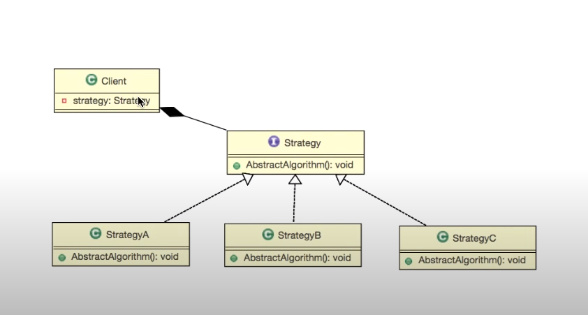
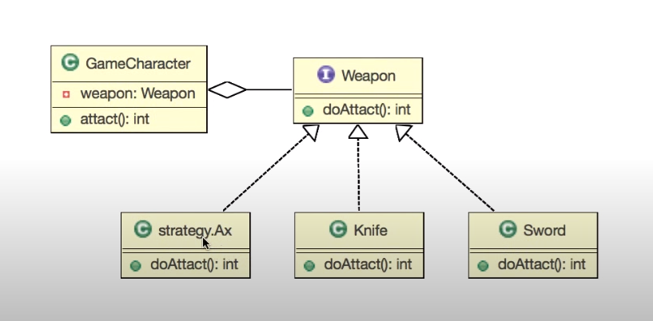

디자인패턴 Ref: Youtube 이야기's G 자바 디자인 패턴

## 스트레티지 패턴
---
### 인터페이스
- 키보드나 디스플레이 따위처럼 사람과 컴퓨터를 연결하는 장치
- 기능에 대한 ```선언과 구현 분리```
- 기능을 사용 ```통로```


예제 코드
```
public interface Ainterface{

    //기능의 선언
    public void funcA();
}

class AinterfaceImpl implements Ainterface{
    @Override
    public void funcA(){

    }

}

public class Main{
    public static void main(String [] args){
        Ainterface ainterface = new AinterfaceImpl();
        
        //통로가 됨
      //  ainterface.funcA();

        AObj aobj = new AObj();
        aobj.funcAA();
    }
}

```


### 델리게이트
- 위임하다

예제코드
```
public class AObj{
    Ainterface ainterface;

    public AObj(){
        ainterface = new AinterfaceImpl();
    }

    public void funcAA(){
        //특정 기능의 객체를 사용하기 위해 다른 객체에서 호출하는 방식이 델리케이트
        
        //위임한다.
        ainterface.funcA();
        ainterface.funcA();
        
        //System.out.println("AAA");
        //System.out.println("AAA");

        // ~ 기능이 필요합니다.
    }
}
```

### 스트레티지 패턴
- 여러 알고리즘을 하나의 추상적인 접근점을 만들어 접근 점에서 서로 교환가능하도록 하는 패턴

#### 구조



- 클라이언트는 전략을 소유하고 있다.
- 각각의 전략은 a,b,c를 소유할 수 있고 세팅을 수행할 수 있다.

### 예제코드
#### 요구사항
- 신작 게임에서 캐릭터와 무기를 구현하자
- 무기의 종류는 두가지가 존재
  - 칼
  - 검


```
public interface Weapon{

    public void attack();
}

public class Knife implements Weapon{

    @Override
    public void attact(){
        System.out.println("칼 공격");
    }
}

public class Sword implements Weapon{

    @Override
    public void attact(){
        System.out.println("검 공격");
    }
}

public class GameCharacter{

    //접근점
    public Weapon weapon;
    //교환가능
    public void setWeapon(Weapon weapon){
        this.weapon.weapon;
    }

    public void attact(){
        //델리게이트
        if(weapon == null){
            System.out.println("맨손 공격");
        }else{
             weapon.attack(); //어떻게 공격하는지 따라서 달라진다
        }
       
    }
}

public class Main{
    GameCharacter character = new GameCharacter();

    character.attack();

    charactor.setWeapon(new Knife());//통로를 만들어서(나이프)
    character.attack();//위임을 한다.

    charactor.setWeapon(new Sword());
    character.attack();
}
```
## 스트레티지 패턴의 정의
- 여러 알고리즘을 하나의 추상적인 접근점을 만들어 접근 점에서 서로 교환 가능하도록 하는 패턴


### 만약 유지보수 요청이 들어왔다면?
- 도끼를 하나 추가해 주십시오
```
public class Ax implements Weapon{

    @Override
    public void attact(){
        System.out.println("도끼 공격");
    }

}//기존 클래스에서 도끼 클래스만 새로 추가해주면 된다.

public class Main{
    GameCharacter character = new GameCharacter();

    character.attack();

    charactor.setWeapon(new Knife());
    character.attack();

    charactor.setWeapon(new Sword());
    character.attack();

    charactor.setWeapon(new Ax());//통로를 추가하여
    charactor.attack();//위임을 한다.
}
```

실제로 구현한 구조



- 캐릭터가 공격을 하는 무기를 선택한 무기에 따라 결과가 달라짐
