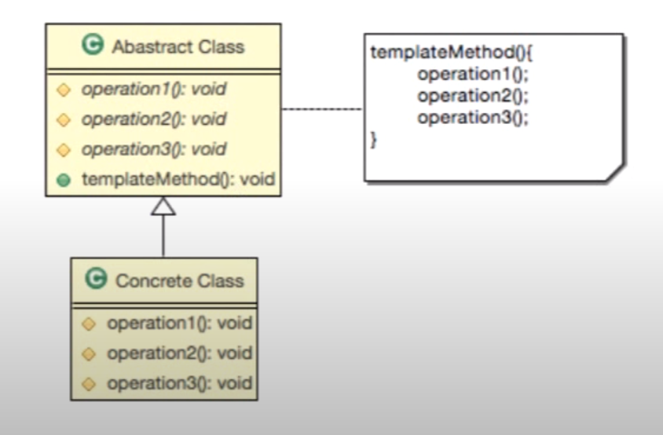

디자인패턴 Ref: Youtube 이야기's G 자바 디자인 패턴

## 템플릿 메서드 패턴
---
목표1
- 구현하려는 알고리즘이 일정한 프로세스가 있다.
- 구현하려는 알고리즘이 변경 가능성이 있다.
---
목표2
- 알고리즘을 ```여러 단계```로 나눈다
- 나눠진 알고리즘의 단계를 ```메소드로 선언```한다
- 알고리즘을 수행할 ```템플릿 메소드```를 만든다
- 하위 클래스에서 나눠진 ```메소드들을 구현```한다.
---
기본 설계



예제코드 요구사항
- 신작 게임의 접속 구현
  - requestConnecting(String str):String
- 유저가 게임 접속시 다음을 고려해야한다.
  - 보안 과정 : 보안 관련 부분을 처리한다.
    - doSecurity(String string): String
  - 인증과정 : user name과 password가 일치하는지 확인
    - authentication(String id, String password):boolean
  - 권한과정 : 접속자가 유료 회원인지 무료 회원인지 게임 마스터인지 확인
    - authorization(String userName):int
  - 접속과정 : 접속자에게 커넥션을 정보로 넘겨준다
    - connection(String info):String


예제코드(상당히 깁니다.)
```
public abstract class AbstractGameConnectHelper{
    protected abstract String doSecurity(String string);
    protected abstract boolean authentication(String id, String password);
    protected abstract int authorization(String userName);
    protected abstract String connection(String info);

    //템플릿 메소드
    public String requestConnection(String encodedInfo){
        //보안작업 -> 암호화된 문자열을 디 코드
        String decodedInfo = doSecurity(encodedInfo);

        //반환된 것을 가지고 아이디, 암호를 할당한다.
        String id = "aaa";
        String password = "bbb";
        
        if(authentication(id, password)){
            throw new Error("아이디 암호 불일치");
        }

        String userName = "userName";

        int i = authrozation(userName);

        switch(i){
            case -1:
                throw new Error("셧다운");
            case 0: //게임매니저
                break;
            case 1: //유료회원
                break
            case 3: //권없음
                break;
            default: //기타상황
                break;
        }
        return connection();
    }
}

public class DefaultGameConnectHelper extends AbstGameConnectHelper{

    @Override
    protected String doSecurity(String string){
        System.out.println("디코드");
        return string;
    }

    @Override
    protected boolean authentication(String id, String password){
        System.out.println("아이디/암호 확인 과정");
        return true;
    }

    @Override
    protected int authorization(String userName){
        System.out.println("권한 확인");
        return 0;
    }

    @Override
    protected String connection(String info){
        System.out.println("마지막 접속 단계");
        return;
    }
}

public class Main{
    public static void main(String[] args){
        AbstGameConnectHelper helper = new DefaultGameConnectHelper();

        helper.requestConnection("아이디 암호 등 접속 정보");
    }
}
```

## 더 공부해 봅시다.

- 보안 부분이 정부 정책에 의해서 강화되었다. 강회돤 방식으로 코드 변경을 해야한다
- 여가부에서 10시 이후에 접속을 제한시켜야 한다.

필요한 부분만 작성
```
구현하는 템플릿 메소드만 따로 재정의한다.

public class DefaultGameConnectHelper extends AbstGameConnectHelper{
    //수정
    @Override
    protected String doSecurity(String string){
        System.out.println("강화된 디코드");
        return string;
    }

    @Override
    protected boolean authentication(String id, String password){
        System.out.println("아이디/암호 확인 과정");
        return true;
    }

    @Override
    protected int authorization(String userName){
        System.out.println("권한 확인");
        //서버에서 유저이름 유저의 나이를 알 수 잇다.
        //나이를 확인하고 시간을 확인하고 성인이 아니고 10시가 지났으면 
        //권한이 없는 것으로 판단.
        return 0;
    }

    @Override
    protected String connection(String info){
        System.out.println("마지막 접속 단계");
        return;
    }
}

```

### 결론
- 템플릿 메소드는 일정한 프로세스를 가진 요구사항을 추상클래스 구현 방식을 이용하여 구현한다.
- 템플릿 메소드는 알고리즘의 구조를 메소드에 정의하고, 하위 클래스에서 알고리즘 구조의 변경없이 알고리즘을 재정의하는 패턴이다.
- 템플릿 메서드 패턴은 알고리즘을 여러 단계로 나누고, 나눠진 알고리즘의 단계를 메소드로 선언하고, 알고리즘을 수행할 템플릿 메서드를 만들며, 하위 클래스에서 나눠진 메소드들을 구현한다.
